# Cilium PolicyPilot 🐝

Turn real traffic into safe **CiliumNetworkPolicies** in minutes.

PolicyPilot learns from Hubble flows, proposes **least-privilege** policies, verifies them safely, and explains results with diagrams.

## Features

- 🔍 **Learn**: Capture and parse Hubble network flows
- 🎯 **Propose**: Generate least-privilege CiliumNetworkPolicies from observed traffic
- ✅ **Verify**: Validate policy syntax and structure
- 📊 **Explain**: Generate HTML reports with network graphs and statistics

## Quickstart

### Prerequisites

- Go 1.23+ installed
- Access to Hubble flows (JSON format) or Hubble CLI

### Installation

```bash
git clone https://github.com/prabhakaran-jm/cilium-policypilot.git
cd cilium-policypilot
go build -o cpp ./cmd/cpp
```

### Basic Usage

```bash
# 1. Learn from Hubble flows
./cpp learn --input examples/sample-flows.json

# 2. Generate policies
./cpp propose

# 3. Verify policies
./cpp verify

# 4. Generate HTML report
./cpp explain
```

## Commands

### `learn`

Capture or read Hubble flows from JSON files.

```bash
# Read from file
./cpp learn --input flows.json

# Specify output location
./cpp learn --input flows.json --output my-flows.json
```

**Flags:**
- `-i, --input`: Input flows JSON file (default: `out/flows.json`)
- `-o, --output`: Output flows JSON file (default: `out/flows.json`)
- `-d, --duration`: Duration to capture flows (future use)
- `--hubble-endpoint`: Hubble API endpoint (future use)

### `propose`

Generate CiliumNetworkPolicies from parsed flows.

```bash
# Generate policies from default flows file
./cpp propose

# Filter by namespace
./cpp propose --namespace hipstershop

# Custom input/output
./cpp propose --input my-flows.json --output my-policies.yaml
```

**Flags:**
- `-i, --input`: Input flows JSON file (default: `out/flows.json`)
- `-o, --output`: Output policy YAML file (default: `out/policy.yaml`)
- `-n, --namespace`: Filter flows by namespace (optional)

### `verify`

Validate policy YAML syntax and structure.

```bash
# Verify default policy file
./cpp verify

# Verify custom policy file
./cpp verify --input my-policies.yaml
```

**Flags:**
- `-i, --input`: Input policy YAML file (default: `out/policy.yaml`)

**Validates:**
- YAML syntax
- Required fields (apiVersion, kind, metadata, spec)
- CiliumNetworkPolicy structure
- Endpoint selectors
- Ingress/egress rules
- Port and protocol specifications

### `explain`

Generate HTML report with flow statistics, policies, and network visualization.

```bash
# Generate report from default files
./cpp explain

# Custom files
./cpp explain --flows my-flows.json --policies my-policies.yaml --output report.html
```

**Flags:**
- `-f, --flows`: Input flows JSON file (default: `out/flows.json`)
- `-p, --policies`: Input policies YAML file (default: `out/policy.yaml`)
- `-o, --output`: Output HTML report file (default: `out/report.html`)

**Report includes:**
- Statistics dashboard (flows, policies, namespaces, protocols)
- Interactive Mermaid network graph
- Policy list with endpoint selectors
- Namespace and protocol badges

## Examples

### Example 1: Basic Workflow

```bash
# Start with sample flows
./cpp learn --input examples/sample-flows.json

# Generate policies
./cpp propose

# Verify policies
./cpp verify

# Generate report
./cpp explain

# Open report in browser
open out/report.html  # macOS
xdg-open out/report.html  # Linux
start out/report.html  # Windows
```

### Example 2: HipsterShop Microservices

```bash
# Use HipsterShop example
./cpp learn --input examples/hipstershop-flows.json

# Generate policies for hipstershop namespace
./cpp propose --namespace hipstershop --output hipstershop-policies.yaml

# Verify and generate report
./cpp verify --input hipstershop-policies.yaml
./cpp explain --flows out/flows.json --policies hipstershop-policies.yaml
```

### Example 3: Custom Workflow

```bash
# Capture flows from Hubble CLI (if available)
hubble observe -o json --since 5m > my-flows.json

# Process flows
./cpp learn --input my-flows.json --output processed-flows.json
./cpp propose --input processed-flows.json --output my-policies.yaml --namespace production
./cpp verify --input my-policies.yaml
./cpp explain --flows processed-flows.json --policies my-policies.yaml --output my-report.html
```

## Architecture

### Directory Structure

```
cilium-policypilot/
├── cmd/cpp/              # CLI entry point
├── internal/
│   ├── hubble/          # Hubble flow parsing and reading
│   ├── synth/           # Policy synthesis from flows
│   ├── verify/          # Policy validation
│   ├── explain/         # HTML report generation
│   ├── graph/           # Network graph generation
│   └── validate/        # Input validation utilities
├── examples/            # Example flow files
│   ├── sample-flows.json
│   └── hipstershop-flows.json
└── out/                 # Generated outputs (gitignored)
```

### Component Architecture


### Data Flow


### System Integration


## How It Works

### Workflow Sequence

```mermaid
sequenceDiagram
    participant User
    participant CLI as PolicyPilot CLI
    participant Hubble as Hubble Parser
    participant Synth as Policy Synthesizer
    participant Verify as Policy Validator
    participant Explain as Report Generator
    participant Graph as Graph Builder

    User->>CLI: learn --input flows.json
    CLI->>Hubble: ReadFlowsFromFile()
    Hubble->>Hubble: Parse flows & extract metadata
    Hubble-->>CLI: ParsedFlows[]
    CLI-->>User: Flows saved to out/flows.json

    User->>CLI: propose --namespace hipstershop
    CLI->>Hubble: ReadFlowsFromFile()
    Hubble-->>CLI: FlowCollection
    CLI->>Synth: SynthesizePolicies(flows)
    Synth->>Synth: Group flows by destination
    Synth->>Synth: Generate ingress rules
    Synth->>Synth: Aggregate ports/protocols
    Synth-->>CLI: Policies[]
    CLI-->>User: Policies saved to out/policy.yaml

    User->>CLI: verify --input policy.yaml
    CLI->>Verify: VerifyPolicies(file)
    Verify->>Verify: Validate YAML syntax
    Verify->>Verify: Check required fields
    Verify->>Verify: Validate selectors & rules
    Verify-->>CLI: VerificationResult
    CLI-->>User: ✓ All policies valid

    User->>CLI: explain --flows flows.json --policies policy.yaml
    CLI->>Explain: GenerateReport(flows, policies)
    Explain->>Graph: GenerateGraph(flows)
    Graph-->>Explain: Network Graph
    Explain->>Explain: Collect statistics
    Explain-->>CLI: ReportData
    CLI-->>User: Report saved to out/report.html
```



### Policy Synthesis Algorithm


### Example: Flow to Policy Transformation


### Detailed Process

1. **Learn**: Reads Hubble flow data (JSON format) and extracts key metadata:
   - Source/destination pod labels and namespaces
   - Ports and protocols (TCP/UDP)
   - Flow direction and verdict
   - IP addresses and identities

2. **Propose**: Analyzes flows and generates least-privilege policies:
   - Groups flows by destination endpoint (namespace + labels)
   - For each destination, groups sources by labels
   - Aggregates ports and protocols per source
   - Creates ingress rules with `fromEndpoints` and `toPorts`
   - Generates valid CiliumNetworkPolicy YAML

3. **Verify**: Validates generated policies:
   - Checks YAML syntax and structure
   - Validates required fields (apiVersion, kind, metadata, spec)
   - Ensures proper CiliumNetworkPolicy structure
   - Validates endpoint selectors (matchLabels format)
   - Validates ingress/egress rules and port specifications

4. **Explain**: Creates visual reports:
   - Generates network graph (Mermaid format) showing pod-to-pod connections
   - Collects statistics (flows, policies, namespaces, protocols)
   - Creates interactive HTML report with embedded graph
   - Provides policy summaries and flow analysis

## Output Files

- `out/flows.json`: Parsed and validated flows (same format as input, validated)
- `out/policy.yaml`: Generated CiliumNetworkPolicies (multi-document YAML, one policy per document)
- `out/report.html`: HTML report with statistics and network graph (self-contained, includes Mermaid.js)

### Policy YAML Structure

Each generated policy follows this structure:

```yaml
apiVersion: cilium.io/v2
kind: CiliumNetworkPolicy
metadata:
  name: <service-name>-policy
  namespace: <namespace>
spec:
  endpointSelector:
    matchLabels:
      k8s:app: <service-name>
  ingress:
    - fromEndpoints:
        - matchLabels:
            k8s:app: <source-service>
      toPorts:
        - ports:
            - port: "<port>"
              protocol: TCP|UDP
```

**Key characteristics:**
- One policy per destination endpoint
- Ingress rules only (based on observed traffic)
- Least-privilege: only allows observed connections
- Ports and protocols aggregated per source

## Why

Writing CiliumNetworkPolicies by hand is error-prone:
- **Too tight**: Breaks workloads, causes outages
- **Too loose**: Opens security holes, violates compliance

PolicyPilot helps engineers find the **sweet spot** by:
- Learning from actual traffic patterns
- Generating least-privilege policies automatically
- Validating policies before deployment
- Visualizing network topology and policies

## Requirements

- **Go**: 1.23 or higher
- **Hubble**: Access to Hubble flows (JSON format) or Hubble CLI
- **Cilium**: Understanding of CiliumNetworkPolicy structure

## Best Practices

### 1. Flow Collection

- **Capture sufficient traffic**: Collect flows during normal operation to capture all legitimate connections
- **Time window**: Use a representative time period (e.g., 1 hour of peak traffic)
- **Multiple captures**: Consider capturing flows at different times to catch periodic connections

```bash
# Capture flows during peak hours
hubble observe -o json --since 1h > peak-traffic-flows.json
```

### 2. Policy Generation

- **Namespace filtering**: Use `--namespace` to generate policies for specific namespaces
- **Review before applying**: Always review generated policies before applying to production
- **Test in staging**: Apply policies to a staging environment first

```bash
# Generate policies for specific namespace
./cpp propose --namespace production --output prod-policies.yaml

# Review policies
cat prod-policies.yaml

# Apply to staging first
kubectl apply -f prod-policies.yaml -n staging
```

### 3. Policy Verification

- **Always verify**: Run `verify` before applying policies
- **Check for errors**: Review any validation errors or warnings
- **Validate manually**: For critical services, manually review policy rules

### 4. Policy Deployment

- **Gradual rollout**: Apply policies gradually, starting with non-critical services
- **Monitor impact**: Watch for connection issues after applying policies
- **Keep backups**: Keep original flow data and generated policies for reference

## Troubleshooting

### Issue: "no flows found in namespace"

**Cause**: The flows don't contain the specified namespace, or flows are missing namespace information.

**Solution**:
```bash
# Check namespaces in flows
grep -i "namespace" flows.json | head -5

# Generate policies without namespace filter
./cpp propose --input flows.json

# Or use the correct namespace
./cpp propose --namespace <actual-namespace>
```

### Issue: "file does not exist"

**Cause**: Previous command didn't complete successfully, or file path is incorrect.

**Solution**:
```bash
# Check if files exist
ls -la out/

# Run commands in order: learn → propose → verify → explain
./cpp learn --input examples/sample-flows.json
./cpp propose
./cpp verify
./cpp explain
```

### Issue: "invalid policy file: YAML syntax error"

**Cause**: Generated YAML file is corrupted or invalid.

**Solution**:
```bash
# Regenerate policies
./cpp propose --input flows.json --output new-policies.yaml

# Verify the new file
./cpp verify --input new-policies.yaml
```

### Issue: HTML report graph not rendering

**Cause**: Browser doesn't support JavaScript, or Mermaid.js CDN is blocked.

**Solution**:
- Use a modern browser (Chrome, Firefox, Edge)
- Check browser console for errors
- Ensure internet connection (Mermaid.js loads from CDN)
- Check if corporate firewall blocks CDN access

### Issue: Policies too restrictive (blocking legitimate traffic)

**Cause**: Flow capture didn't include all necessary connections, or traffic patterns changed.

**Solution**:
```bash
# Capture more comprehensive flows
hubble observe -o json --since 24h > comprehensive-flows.json

# Regenerate policies
./cpp learn --input comprehensive-flows.json
./cpp propose

# Or manually edit policies to add missing rules
```

### Issue: Policies too permissive (security concern)

**Cause**: Flow capture included unauthorized or malicious traffic.

**Solution**:
- Review flows before generating policies
- Filter out suspicious flows
- Manually tighten policies after generation
- Use namespace filtering to limit scope

## Limitations

### Current Limitations

1. **Ingress-only policies**: Currently generates ingress rules only (based on observed traffic to destinations)
2. **No egress rules**: Egress policies are not generated (future enhancement)
3. **No L7 policies**: Only L4 (port/protocol) policies are generated
4. **No CIDR rules**: Policies don't include CIDR-based rules (only pod-to-pod)
5. **No service account matching**: Policies use pod labels, not service accounts
6. **Single namespace per run**: Namespace filtering works, but cross-namespace policies need manual handling

### Future Enhancements

- [ ] Egress policy generation
- [ ] L7 (HTTP) policy support
- [ ] CIDR-based rules
- [ ] Service account selectors
- [ ] Policy merging and optimization
- [ ] Direct Hubble API integration
- [ ] Real-time flow capture
- [ ] Policy diff and updates

## Performance Considerations

### Flow Processing

- **Large flow files**: PolicyPilot can handle thousands of flows efficiently
- **Memory usage**: Approximately 1-2 MB per 1000 flows
- **Processing time**: ~100ms per 1000 flows on modern hardware

### Policy Generation

- **Grouping algorithm**: O(n) complexity where n is number of flows
- **Policy count**: One policy per unique destination endpoint
- **YAML generation**: Efficient YAML marshaling using `gopkg.in/yaml.v3`

### Recommendations

- For very large flow sets (>10,000 flows), consider filtering by namespace first
- Use namespace filtering to reduce processing time
- Generate reports only when needed (they can be large for many flows)

## Understanding CiliumNetworkPolicies

### What are CiliumNetworkPolicies?

CiliumNetworkPolicies are Kubernetes network policies enforced by Cilium using eBPF. They control network traffic between pods based on:

- **Endpoint selectors**: Match pods using labels
- **Ingress rules**: Control incoming traffic to pods
- **Egress rules**: Control outgoing traffic from pods
- **Port/protocol**: Specify allowed ports and protocols (TCP/UDP)

### Why Least-Privilege?

Least-privilege network policies:
- ✅ **Improve security**: Only allow necessary connections
- ✅ **Reduce attack surface**: Limit potential paths for attackers
- ✅ **Compliance**: Meet security requirements and best practices
- ✅ **Visibility**: Make network dependencies explicit

### PolicyPilot's Approach

PolicyPilot generates least-privilege policies by:
1. **Observing actual traffic**: Uses real network flows, not assumptions
2. **Grouping by destination**: Creates one policy per service
3. **Aggregating sources**: Groups multiple sources into ingress rules
4. **Port aggregation**: Combines multiple ports per source when possible

## Contributing

This project was built for the eBPF Summit Hackathon. Contributions welcome!

### Development Setup

```bash
# Clone repository
git clone https://github.com/prabhakaran-jm/cilium-policypilot.git
cd cilium-policypilot

# Build
go build -o cpp ./cmd/cpp

# Run tests
go test ./...

# Run with verbose output
go test -v ./...
```

### Code Structure

- **`cmd/cpp/`**: CLI entry point and command definitions
- **`internal/hubble/`**: Hubble flow parsing and types
- **`internal/synth/`**: Policy synthesis logic
- **`internal/verify/`**: Policy validation
- **`internal/explain/`**: HTML report generation
- **`internal/graph/`**: Network graph generation
- **`internal/validate/`**: Input validation utilities

### Adding Features

1. Create a feature branch
2. Add tests for new functionality
3. Update documentation
4. Submit a pull request

## License

Apache License 2.0 - see [LICENSE](LICENSE) file for details.

## Related Projects

- [Cilium](https://github.com/cilium/cilium) - eBPF-based networking, security, and observability
- [Hubble](https://github.com/cilium/hubble) - Network, service & security observability for Kubernetes
- [Tetragon](https://github.com/cilium/tetragon) - eBPF-based Security Observability and Runtime Enforcement

## Acknowledgments

Built for the eBPF Summit Hackathon 2024. Powered by eBPF and Cilium technologies.
